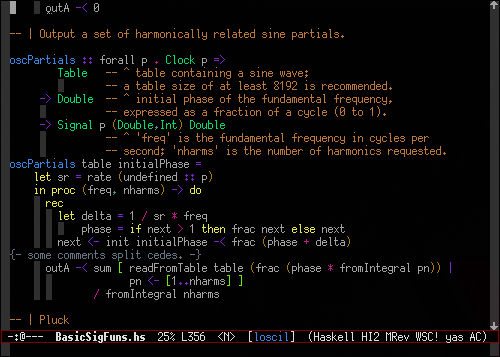
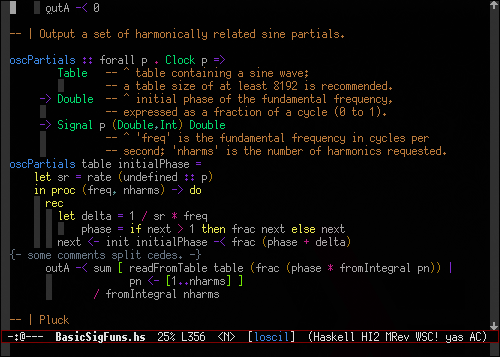
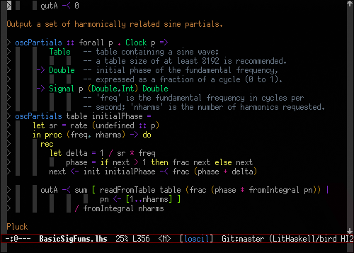
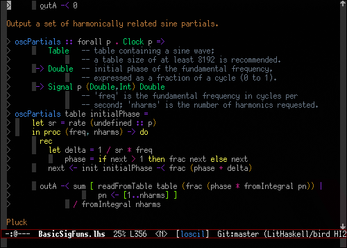

# haskell-highlight-indentation
A emacs minor mode for highlight indentation by font-lock system.

This mode is intended to work with haskell language.
However, it can also be used in any other mode.

### Styles
There are 4 styles.

The style select via haskell-highlight-indentation-style variable.

* **previous code indentation levels (default)**

  

* **previous code indentation levels (speed priority)**

  Like a above style.
  But this mode does not exceed ride a comment.

  

* **by column count**

  Highlight each `haskell-highlight-indentation-column' columns

  

* **column count (only last)**

  Like a above style.
  But nearest one (only one column per line) is highlighted.
  
  
